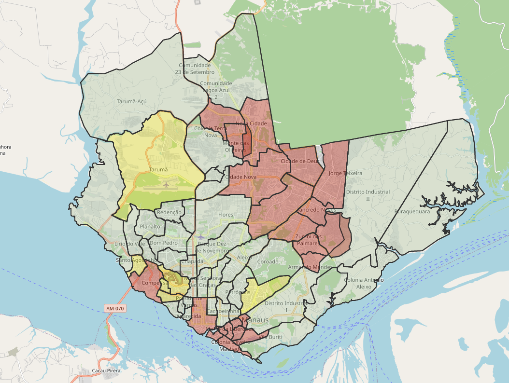

# mapa-criminalidade-bairros-manaus
Quantitativo criminal de Manaus em 2021 em homicídios, latrocínio, lesão corporal seguida de morte, roubo, furto, feminicídio, estupro, roubo de veículos, furto de veículos, violência doméstica, violência contra crianças e adolescentes, violência contra idosos e desaparecidos separado por bairros.

## Conceito
 .
